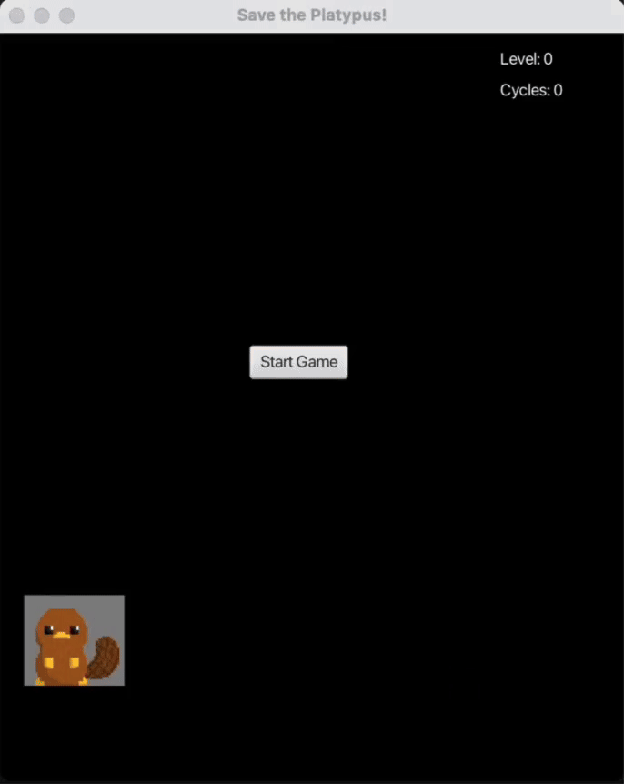

# Save the Platypus!



## Summary

"Save the Platypus!" is a 2D arcade-style game built using Java and JavaFX. Guide your platypus to survive waves of enemy projectiles as long as possible. Projectiles appear randomly along the x and y axes and move both vertically and horizontally.

Dodge the attacks using the arrow keys. For every 5 cycles successfully survived, your level increases, and enemies move faster. If the platypus touches a projectile, it’s GAME OVER.

## Motivation
This project was created to strengthen my understanding of Java, JavaFX, and object-oriented programming (OOP). The game uses a class-based structure, with game entities like the platypus and projectiles represented as objects with their own properties and behaviors.

Developing this game helped me reinforce:
- Classes, Inheritance, and Encapsulation
- Modular and Reusable Code Design
- Event Handling and Game Loop Logic in JavaFX

Overall, this project combined learning with fun, giving me hands-on experience applying OOP concepts in an interactive environment.

## Requirements
- JDK 21 installed and active
- Maven installed (or use the included Maven Wrapper `./mvnw` if present)
- macOS: ensure Java 21 is selected

## Quick Start

### From IDE
- Open JavaFXGame.Run or Run.java
- Right-click → Run Java

### From Terminal

In the project root, run:

```bash
./mvnw clean javafx:run
```

## Controls
- Start Game: Click the "Start Game" button
- Arrow Keys: UP / DOWN / LEFT / RIGHT to move your platypus

## Gameplay

- Objective: Survive as many cycles of enemy projectiles as possible.
- Levels: Every 5 cycles survived, the game level increases and enemy speed rises.
- Game Over: Contact with any projectile ends the game.

## Features

- 2D JavaFX Graphics: Smooth animations and dynamic projectile generation
- Object-Oriented Design: Classes for platypus, projectiles, and game management
- Level Progression: Increasing difficulty as you survive longer
- Reusable and Modular Code: Easy to extend with new features or enemy types

## Testing
Run:

```bash
./mvnw test
```

<b> Good luck and have fun! </b>
