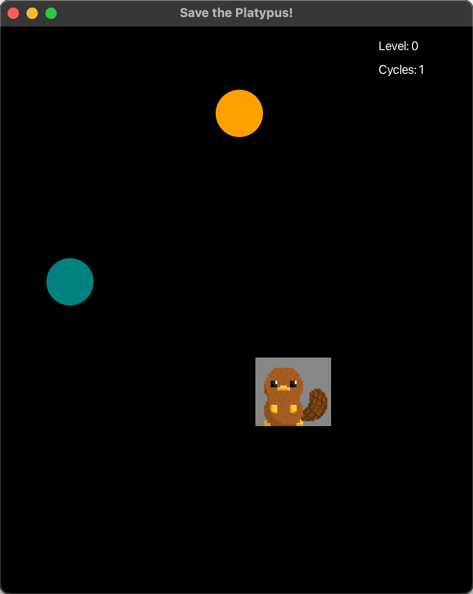

Author: Irene Cheung
StudentID: A01349998

Welcome to "Save the Platypus!"

This is a 2D game made using Java v21.0.2 and JavaFX. 

## How to play the game

The objective of this game is to try to make your platypus survive as many cycles of enemy attacks as possible. 
Enemies are shot across the screen both vertically and horizontally at randomly generated x and y-axis values. To 
survive, use the arrows keys, UP, DOWN, LEFT, and RIGHT to dodge these attacks. For every 5 cycles that you 
successfully dodge the projectiles, you increase a level and the speed of the enemies increases. 
If your platypus touches the enemies at any point, it is GAME OVER.

## How to run the game
Please play from Run.java

Good luck and have fun!

